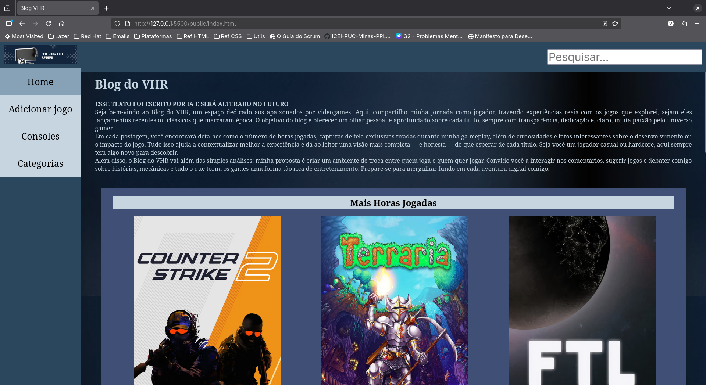
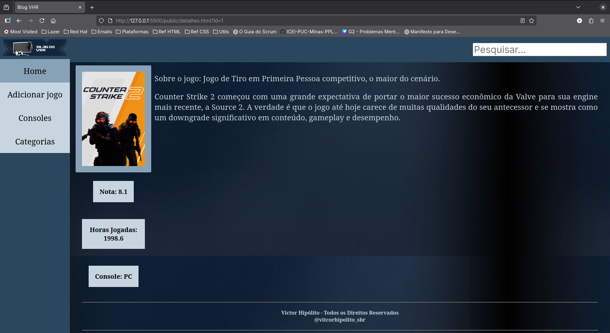

[](https://classroom.github.com/open-in-codespaces?assignment_repo_id=20736892)
# Trabalho Prático 05 - Semanas 7 e 8

**Páginas de detalhes dinâmicas**

Nessa etapa, vamos evoluir o trabalho anterior, acrescentando a página de detalhes, conforme o  projeto escolhido. Imagine que a página principal (home-page) mostre um visão dos vários itens que existem no seu site. Ao clicar em um item, você é direcionado pra a página de detalhes. A página de detalhe vai mostrar todas as informações sobre o item do seu projeto. seja esse item uma notícia, filme, receita, lugar turístico ou evento.

Leia o enunciado completo no Canvas. 

**IMPORTANTE:** Assim como informado anteriormente, capriche na etapa pois você vai precisar dessa parte para as próximas semanas. 

**IMPORTANTE:** Você deve trabalhar e alterar apenas arquivos dentro da pasta **`public`,** mantendo os arquivos **`index.html`**, **`styles.css`** e **`app.js`** com estes nomes, conforme enunciado. Deixe todos os demais arquivos e pastas desse repositório inalterados. **PRESTE MUITA ATENÇÃO NISSO.**

## Informações Gerais

- Nome: Victor Hipolito Silva Braga Reis
- Matricula: 902693
- Proposta de projeto escolhida: 4. Coleções e Itens
- Breve descrição sobre seu projeto: Minha ideia é fazer um site que cataloga jogos que eu completei e exibe informações como horas jogadas, conquistas completas e uma análise com minha avaliação desse jogo.

## Print da Home-Page



## Print da página de detalhes do item



## Cole aqui abaixo a estrutura JSON utilizada no app.js
```javascript
const dados = [
    {
    "id":1,
    "imagem": "images/covers/cs2.png",
    "nome": "Counter Strike 2",
    "horas": 1998.6,
    "nota": 8.1,
    "console": "PC",
    "sobre": "Jogo de Tiro em Primeira Pessoa competitivo, o maior do cenário.",
    "analise": "Counter Strike 2 começou com uma grande expectativa de portar o maior sucesso econômico da Valve para sua engine mais recente, a Source 2. A verdade é que o jogo até hoje carece de muitas qualidades do seu antecessor e se mostra como um downgrade significativo em conteúdo, gameplay e desempenho."
    }
]
```# TP1-DIW
